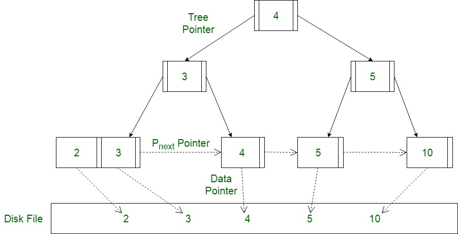

# ohara-db
# ohara-db

[](https://github.com/cocvu99/ohara-db/actions)

## Table of Contents
- [About the Project](#about-the-project)
  - [Architecture Design](#architecture-design)
- [Getting Started](#getting-started)
- [Features Implemented](#features-implemented)
- [Known Issues & Current Constraints](#known-issues--current-constraints)
- [Roadmap & Further Features](#roadmap--further-features)

## Project Overview
A relational database engine built from scratch using Go. This project is a hands-on implementation to deeply understand database internals, focusing on a disk-based B+ Tree storage engine, Key-Value interface, and concurrency control.


### Architecture Design


<!-- *(Chỗ này sẽ cần 2-3 câu giải thích ngắn gọn về luồng hoạt động)* -->

## Getting Started

### Prerequisites
- Go 1.24 or higher

### Build & Test
```bash
# Build the project
go build -v ./...

# Run unit tests
go test -v ./...
```

## Features Implemented
- **BTreeInternalNode**: Defines the structure for Internal Node with keys and children pointers.
- **Search Logic**: `FindLastLE` function to locate the correct insertion index.
- **Node Insertion**: `InsertKV` function to insert key-child pairs while maintaining array order.
- **Unit Testing**: Automated test coverage for B+ Tree insertion logic (`TestDatabase`).
- **CI/CD Integration**: GitHub Actions workflow (`ci.yaml`) configured for:
  - Automated `go build` and `go test` on `push` to `main` and `develop`.
  - Strict formatting (`gofmt`) and code analysis (`go vet`) on `pull_request` to `main`.

